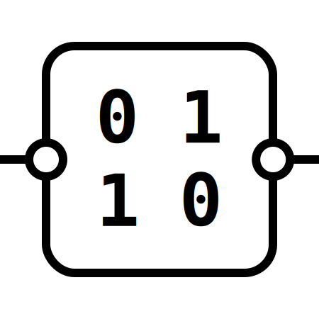

    
    <h1>ChainRec</h1>
    
    
    

Private, tamper-proof copyright records on the blockchain. 

## Feature Checklist

- [x] Writing records
- [x] Anonymous aggregate record reading
- [x] Verified user record reading (query permit)
- [ ] Anonymous Analytics (# of records, # of users)
- [ ] Hash/unhash on frontend (xxhash)
